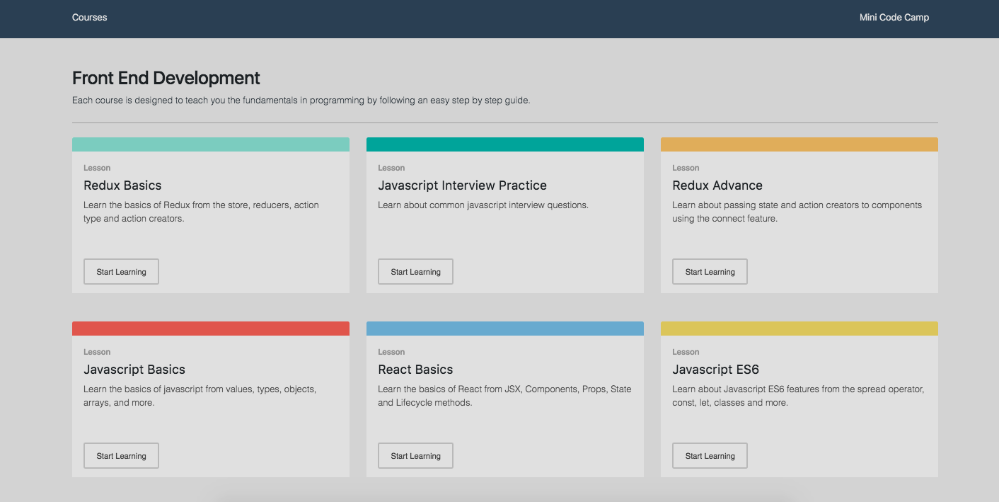
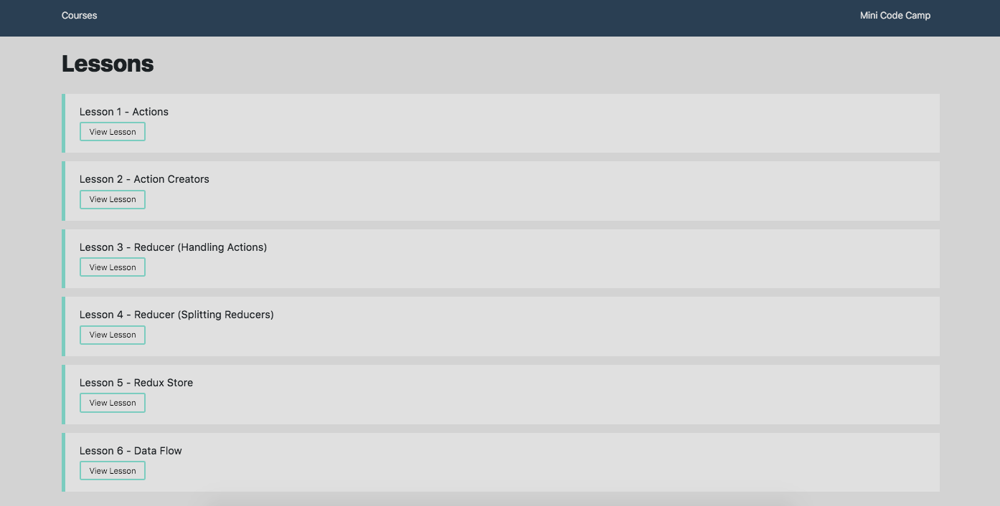
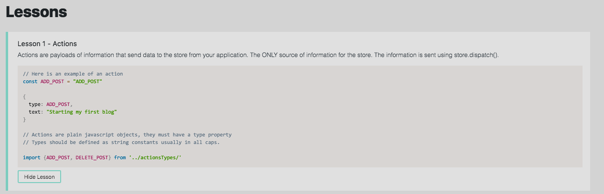

# Mini Code Camp

Created a mern (Mongo, Express, React, Node) application that has lessons on topics from react, redux, to javascript.
The application allows a user to get quick summaries of the main topics covered in each framework or library. The web application breaks down the lessons in a step by step guide with a short description and code example. The lessons are made to teach the topic in the simplest way possible.

## Built With

- [React](https://reactjs.org/) - Front End Framework
- [Redux](https://redux.js.org/) - State Container
- [MongoDB](https://www.mongodb.com/) - Database
